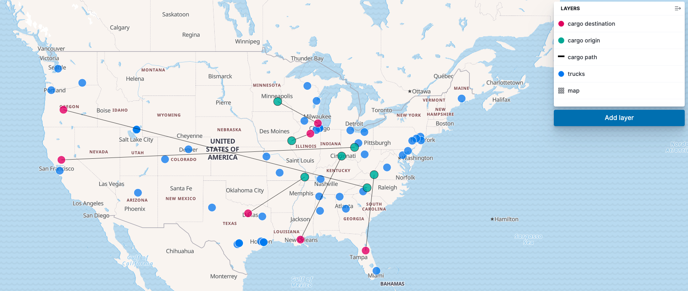

# How it works

This document explains how that solution was developed and how it can be explored.

## Visual demonstration


<small> Preview generated by Kibana </small>

## Algorithms

### Controlling the maximum cargos for each truck

- The default max cargos for truck is 1
```bash
make dev
```

- We can try a max cargo option for truck = 2
```bash
make dev/maxcargo
```

### Calculating distances

- The default distance calculation use the [Harvesine formula](https://en.wikipedia.org/wiki/Haversine_formula)

```bash
make dev
```

- More accurate, you can use the [Google Routes](https://cloud.google.com/maps-platform/routes) remote provider (you must provide GOOGLE_API_KEY env var):
```bash
make run/remote
```


### Designating trucks for cargos

Five different algorithms was developed, with 2 remaining:

- Iteration O log(n<sup>2</sup>) + sorted dictionary
The classic cargos x trucks iteration (sorted dictionary)

```bash
make run
```

-  Iteration only for cargos + O log(n) kd-tree (optimized when the trucks are loaded):
While the trucks are loaded, for each truck appended, we use a kd-tree to manage the locations.

```bash
make run/kdtree
```

## How to dev

- Watch for modifications, run lint and tests
```bash
make dev/watch
```

- Run dev mode (with performance chekc)
```bash
make dev
```

- Apply lint corrections (90% effective), [based on PEP 8](https://www.python.org/dev/peps/pep-0008/)
```bash
make lint/fix
```

## References

I'm not Python senior, but I really appreciate Python's language.

- I followed [The Zen of Python](https://www.python.org/dev/peps/pep-0020/)
- Read Luciano Ramalho's ["Fluent Python"](https://www.amazon.com.br/Fluent-Python-Luciano-Ramalho/dp/1491946008)
- When I'm not applied the *pythonic way*, or in case of doubts, my guide is the  Uncle Bob's ["Clean Code"](https://www.amazon.com.br/Clean-Code-Handbook-Software-Craftsmanship-ebook/dp/B001GSTOAM)

## What I can do with more time

- Add a hash function for the locations: to improve even more the checking for the closest trucks
- Add parallelization processing
- Add algorithm to decide which cargo is best in case of an already designated truck
- Add Docker: there's some code, but it's not totally functional
- Plot maps for the inputs and the final solution

## More options
- For more options check the [Makefile](src/Makefile)
